# Sprint 4: Travel Mode - Data Flow Diagrams

**Version:** 1.0.0
**Last Updated:** October 17, 2025
**Sprint:** Sprint 4 - Travel & Discovery Mode

---

## 📖 Table of Contents

1. [User Journey Flows](#user-journey-flows)
2. [Recommendations Flow](#recommendations-flow)
3. [Graph Connection Flow](#graph-connection-flow)
4. [Auto-Match Flow](#auto-match-flow)
5. [Discovery Feed Flow](#discovery-feed-flow)
6. [Travel Mode Activation Flow](#travel-mode-activation-flow)

---

## User Journey Flows

### Complete Travel Mode User Journey


---

## Recommendations Flow

### Player Recommendations Generation


### Recommendation Acceptance Flow


---

## Graph Connection Flow

### BFS Traversal for Connection Path


### Connection Graph Visualization


---

## Auto-Match Flow

### Auto-Match Trigger & Notification


### Auto-Match Compatibility Scoring

```mermaid
graph TB
    subgraph "Input Features"
        User1[User A Features]
        User2[User B Features]
    end

    subgraph "Scoring Factors (Weighted)"
        F1[Skill Level Match<br/>Weight: 0.30]
        F2[Location Proximity<br/>Weight: 0.25]
        F3[Availability Overlap<br/>Weight: 0.20]
        F4[Mutual Connections<br/>Weight: 0.15]
        F5[Playing Style<br/>Weight: 0.10]
    end

    subgraph "Score Calculation"
        Sum[Weighted Sum<br/>0.0 - 1.0]
    end

    subgraph "Threshold"
        Check{Score ≥<br/>0.70?}
    end

    subgraph "Decision"
        Match[✅ Create Match]
        NoMatch[❌ Skip]
    end

    User1 --> F1
    User2 --> F1
    User1 --> F2
    User2 --> F2
    User1 --> F3
    User2 --> F3
    User1 --> F4
    User2 --> F4
    User1 --> F5
    User2 --> F5

    F1 --> Sum
    F2 --> Sum
    F3 --> Sum
    F4 --> Sum
    F5 --> Sum

    Sum --> Check

    Check -->|Yes| Match
    Check -->|No| NoMatch

    style Match fill:#10b981
    style NoMatch fill:#ef4444
```



---

## Discovery Feed Flow

### Nearby Players & Clubs Discovery

```mermaid
flowchart TD
    Start([User Opens<br/>Discovery Map]) --> CheckLocation{Location<br/>Enabled?}

    CheckLocation -->|No| RequestPermission[Request Location<br/>Permission]
    RequestPermission --> Granted{Permission<br/>Granted?}
    Granted -->|No| ShowCityOnly[Show City-Level<br/>Results Only]
    Granted -->|Yes| GetGPS[Get GPS<br/>Coordinates]

    CheckLocation -->|Yes| GetGPS

    GetGPS --> CheckTravel{Travel Mode<br/>Active?}

    CheckTravel -->|Yes| UseDestination[Use Destination<br/>Location]
    CheckTravel -->|No| UseCurrentLoc[Use Current<br/>Location]

    UseDestination --> QueryPostGIS[Query PostGIS<br/>ST_DWithin]
    UseCurrentLoc --> QueryPostGIS

    QueryPostGIS --> FindPlayers[Find Nearby Players<br/>10km radius]
    QueryPostGIS --> FindClubs[Find Nearby Clubs<br/>20km radius]

    FindPlayers --> ApplyPrivacyP{Apply Privacy<br/>Filters}

    ApplyPrivacyP -->|Public| IncludeP[Include Player]
    ApplyPrivacyP -->|Connections Only| CheckMutualP{Mutual<br/>Friend?}
    ApplyPrivacyP -->|Private| ExcludeP[Exclude Player]

    CheckMutualP -->|Yes| IncludeP
    CheckMutualP -->|No| ExcludeP

    FindClubs --> FilterClubs[Filter by:<br/>- Active<br/>- Has courts<br/>- Rating ≥ 3.5]

    IncludeP --> CalcDistanceP[Calculate Distance<br/>ST_Distance]
    FilterClubs --> CalcDistanceC[Calculate Distance<br/>ST_Distance]

    CalcDistanceP --> SortPlayers[Sort by Distance<br/>Ascending]
    CalcDistanceC --> SortClubs[Sort by Distance<br/>Ascending]

    SortPlayers --> LimitPlayers[Limit to 20<br/>Players]
    SortClubs --> LimitClubs[Limit to 10<br/>Clubs]

    LimitPlayers --> CacheResults[(Cache in Redis<br/>30min TTL)]
    LimitClubs --> CacheResults

    CacheResults --> RenderMap[Render Map<br/>with Markers]

    ShowCityOnly --> RenderMap

    RenderMap --> End([Display<br/>Discovery Feed])

    style Start fill:#3b82f6
    style End fill:#10b981
    style QueryPostGIS fill:#ef4444
    style CacheResults fill:#f59e0b
```



### PostGIS Spatial Query

```mermaid
graph TB
    subgraph "Input"
        UserLoc[User Location<br/>POINT(-3.7038, 40.4168)]
        Radius[Search Radius<br/>10km]
    end

    subgraph "PostGIS Query"
        STBuffer[ST_Buffer<br/>Create 10km circle]
        STDWithin[ST_DWithin<br/>Find within distance]
        STDistance[ST_Distance<br/>Calculate exact distance]
    end

    subgraph "Spatial Index"
        GIST[GIST Index<br/>on location column]
    end

    subgraph "Results"
        Players[(Nearby Players<br/>with distances)]
        Clubs[(Nearby Clubs<br/>with distances)]
    end

    UserLoc --> STBuffer
    Radius --> STBuffer
    STBuffer --> STDWithin

    STDWithin --> GIST
    GIST --> STDistance

    STDistance --> Players
    STDistance --> Clubs

    style GIST fill:#f59e0b
    style Players fill:#10b981
    style Clubs fill:#10b981
```

---

## Travel Mode Activation Flow

### Travel Plan Creation & Activation


### Travel Mode Deactivation


---

## Cache Invalidation Flow

### Cache Invalidation Triggers

```mermaid
flowchart LR
    subgraph "System Events"
        E1[Profile Update]
        E2[New Connection]
        E3[Travel Plan Change]
        E4[Match Completed]
        E5[Privacy Settings]
    end

    subgraph "Database Triggers"
        T1[user_profile<br/>AFTER UPDATE]
        T2[social_connection<br/>AFTER INSERT]
        T3[travel_plans<br/>AFTER UPDATE]
        T4[match<br/>AFTER UPDATE]
        T5[user_privacy<br/>AFTER UPDATE]
    end

    subgraph "Cache Invalidation"
        I1[Invalidate<br/>rec:{user_id}:*]
        I2[Invalidate<br/>graph:{user_id}:*]
        I3[Invalidate<br/>discover:{city}:*]
    end

    subgraph "Background Jobs"
        J1[Queue Rec<br/>Refresh]
        J2[Queue Graph<br/>Rebuild]
    end

    E1 --> T1
    E2 --> T2
    E3 --> T3
    E4 --> T4
    E5 --> T5

    T1 --> I1
    T1 --> I2

    T2 --> I2
    T2 --> J1

    T3 --> I1
    T3 --> I3

    T4 --> J1

    T5 --> I1
    T5 --> I2
    T5 --> I3

    J1 --> I1
    J2 --> I2

    style I1 fill:#f59e0b
    style I2 fill:#f59e0b
    style I3 fill:#f59e0b
    style J1 fill:#10b981
    style J2 fill:#10b981
```

---

*Last updated: October 17, 2025*
*Sprint 4 Version: 1.0.0*
*Next review: November 2025 (Sprint 5)*
