# Sprint 4: Travel Mode - System Architecture

**Version:** 1.0.0
**Last Updated:** October 17, 2025
**Sprint:** Sprint 4 - Travel & Discovery Mode

---

## 📖 Table of Contents

1. [System Overview](#system-overview)
2. [High-Level Architecture](#high-level-architecture)
3. [Component Architecture](#component-architecture)
4. [Data Architecture](#data-architecture)
5. [API Architecture](#api-architecture)
6. [Caching Strategy](#caching-strategy)
7. [Security Architecture](#security-architecture)

---

## System Overview

Travel Mode is a comprehensive social discovery and recommendation system built on Next.js, Supabase, and Redis caching.

### Key Components

- **Frontend:** Next.js 15 + React Server Components
- **Backend:** Next.js API Routes + Supabase Edge Functions
- **Database:** PostgreSQL (Supabase) with PostGIS
- **Cache:** Redis (Upstash)
- **Auth:** Supabase Auth (JWT)
- **Deployment:** Vercel Edge Network

---

## High-Level Architecture


---

## Component Architecture

### Travel Mode Components

```mermaid
graph LR
    subgraph "Frontend Components"
        TravelDash[Travel Dashboard]
        DiscMap[Discovery Map]
        RecFeed[Recommendations<br/>Feed]
        ConnGraph[Connection<br/>Graph Viz]
        AutoMatchUI[Auto-Match<br/>Settings]
    end

    subgraph "API Endpoints"
        RecAPI[/api/recommendations]
        GraphAPI[/api/graph/connection]
        DiscAPI[/api/discover/*]
        MatchAPI[/api/auto-match/*]
        TravelAPI[/api/travel-mode/*]
    end

    subgraph "Core Services"
        RecSvc[Recommendations<br/>Service]
        GraphSvc[Graph<br/>Service]
        DiscSvc[Discovery<br/>Service]
        MatchSvc[Auto-Match<br/>Service]
    end

    subgraph "Data Models"
        UserProfile[user_profile]
        TravelPlan[travel_plans]
        Recommendation[recommendation]
        Connection[social_connection]
        Organization[organization]
        Tournament[tournament]
    end

    TravelDash --> RecAPI
    TravelDash --> TravelAPI
    DiscMap --> DiscAPI
    RecFeed --> RecAPI
    ConnGraph --> GraphAPI
    AutoMatchUI --> MatchAPI

    RecAPI --> RecSvc
    GraphAPI --> GraphSvc
    DiscAPI --> DiscSvc
    MatchAPI --> MatchSvc
    TravelAPI --> RecSvc

    RecSvc --> UserProfile
    RecSvc --> TravelPlan
    RecSvc --> Recommendation
    GraphSvc --> Connection
    DiscSvc --> Organization
    MatchSvc --> Recommendation

    style TravelDash fill:#3b82f6
    style RecAPI fill:#10b981
    style RecSvc fill:#f59e0b
    style UserProfile fill:#ef4444
```

---

## Data Architecture

### Database Schema (Travel Mode)


### PostGIS Spatial Queries

```mermaid
graph TB
    subgraph "Spatial Data"
        UserLoc[User Location<br/>POINT(lng, lat)]
        OrgLoc[Club Location<br/>POINT(lng, lat)]
    end

    subgraph "Spatial Functions"
        Nearby[ST_DWithin<br/>Radius Search]
        Distance[ST_Distance<br/>Calculate Distance]
        Buffer[ST_Buffer<br/>Create Radius]
    end

    subgraph "Spatial Indexes"
        GiST[GIST Index<br/>location column]
    end

    subgraph "Query Results"
        NearbyUsers[Nearby Users<br/>Within 10km]
        NearbyClubs[Nearby Clubs<br/>Within 20km]
    end

    UserLoc --> Nearby
    OrgLoc --> Nearby
    Nearby --> GiST
    GiST --> NearbyUsers
    GiST --> NearbyClubs

    UserLoc --> Distance
    OrgLoc --> Distance
    Distance --> NearbyUsers
    Distance --> NearbyClubs

    UserLoc --> Buffer
    Buffer --> Nearby

    style GiST fill:#f59e0b
    style Nearby fill:#10b981
    style NearbyUsers fill:#3b82f6
    style NearbyClubs fill:#3b82f6
```

---

## API Architecture

### Recommendations API Flow


### Graph Connection API Flow


---

## Caching Strategy

### Cache Layers


### Cache Invalidation Flow


---

## Security Architecture

### Authentication & Authorization Flow


### Row Level Security (RLS) Policies

```mermaid
graph TB
    subgraph "RLS Policy Engine"
        Policy1[Travel Plans:<br/>Own records only]
        Policy2[Recommendations:<br/>Own records only]
        Policy3[Connections:<br/>Mutual or public]
        Policy4[User Profiles:<br/>Public or connected]
    end

    subgraph "Policy Logic"
        Check1{user_id =<br/>auth.uid?}
        Check2{Privacy =<br/>public?}
        Check3{Mutual<br/>friend?}
        Check4{Admin<br/>role?}
    end

    subgraph "Access Decision"
        Allow[✅ Allow Access]
        Deny[❌ Deny Access]
    end

    Policy1 --> Check1
    Policy2 --> Check1
    Policy3 --> Check2
    Policy4 --> Check2

    Check1 -->|Yes| Allow
    Check1 -->|No| Check4

    Check2 -->|Yes| Allow
    Check2 -->|No| Check3

    Check3 -->|Yes| Allow
    Check3 -->|No| Deny

    Check4 -->|Yes| Allow
    Check4 -->|No| Deny

    style Allow fill:#10b981
    style Deny fill:#ef4444
```



### Privacy Controls


---

## Deployment Architecture


---

## Performance Optimization

### Query Optimization Flow

```mermaid
graph LR
    subgraph "Query Entry"
        Request[API Request]
    end

    subgraph "Optimization Layers"
        L1[L1: Redis Cache<br/>Sub-50ms]
        L2[L2: DB Cache<br/>Sub-100ms]
        L3[L3: Indexed Query<br/>Sub-200ms]
        L4[L4: Full Scan<br/>>500ms]
    end

    subgraph "Results"
        Fast[✅ Fast Response<br/><200ms]
        Slow[⚠️ Slow Response<br/>>200ms]
    end

    Request --> L1
    L1 -->|Hit| Fast
    L1 -->|Miss| L2
    L2 -->|Hit| Fast
    L2 -->|Miss| L3
    L3 -->|Hit| Fast
    L3 -->|Miss| L4
    L4 --> Slow

    style Fast fill:#10b981
    style Slow fill:#f59e0b
```



---

*Last updated: October 17, 2025*
*Sprint 4 Version: 1.0.0*
*Next review: November 2025 (Sprint 5)*
