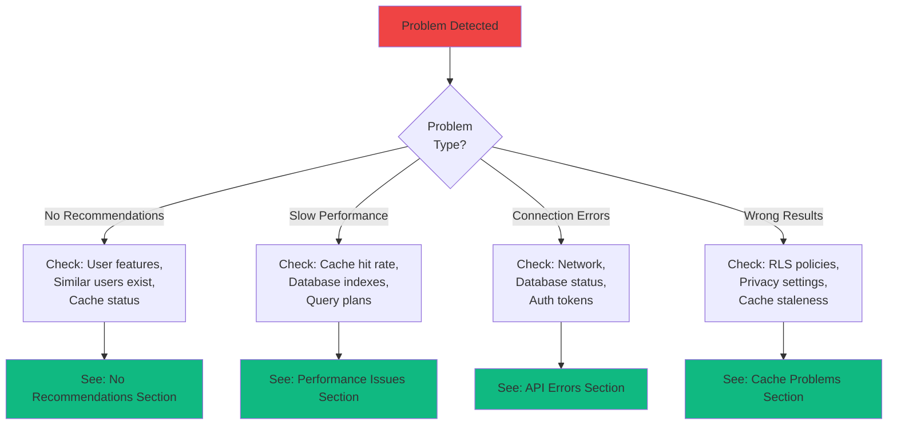

# Travel Mode - Comprehensive Troubleshooting Guide

**Version:** 1.0.0
**Last Updated:** October 17, 2025
**Audience:** Developers, Support Team, Power Users

---

## 📖 Table of Contents

1. [Quick Diagnostics](#quick-diagnostics)
2. [Common Issues](#common-issues)
3. [API Errors](#api-errors)
4. [Performance Issues](#performance-issues)
5. [Cache Problems](#cache-problems)
6. [Database Issues](#database-issues)
7. [Privacy & Security](#privacy--security)
8. [Debugging Tools](#debugging-tools)

---

## Quick Diagnostics

### System Health Check

Run this checklist before investigating specific issues:

```bash
# 1. Check API health
curl https://api.padelgraph.com/health

# Expected: {"status": "healthy", "services": {"database": "up", "redis": "up"}}

# 2. Check authentication
curl -H "Authorization: Bearer $TOKEN" https://api.padelgraph.com/api/recommendations

# Expected: 200 OK or 401 if token expired

# 3. Check database connection
npm run db:test-connection

# Expected: "Database connection successful"

# 4. Check Redis connection
redis-cli PING

# Expected: "PONG"

# 5. Check TypeScript compilation
npm run typecheck

# Expected: "0 errors"

# 6. Check build
npm run build

# Expected: Build completes without errors
```

### Quick Decision Tree



---

## Common Issues

### Issue 1: No Recommendations Appearing

**Symptoms:**
- Empty recommendations array returned
- User sees "No recommendations available" message
- Fresh recommendations not generating

**Diagnosis:**

```bash
# Check user has completed profile
npm run admin:check-profile -- --user-id USER_ID

# Check similar users exist
npm run admin:check-similar-users -- --user-id USER_ID

# Check database for any recommendations
npm run admin:query -- "SELECT COUNT(*) FROM recommendation WHERE user_id = 'USER_ID'"

# Check cache status
redis-cli GET "rec:USER_ID:player"
```

**Common Causes:**

1. **Incomplete User Profile**
   ```sql
   -- Check profile completeness
   SELECT
     id,
     name,
     level,
     city,
     location,
     skill_rating
   FROM user_profile
   WHERE id = 'USER_ID';

   -- Missing fields = incomplete profile
   ```

   **Fix:**
   ```typescript
   // Prompt user to complete profile
   const missingFields = [];
   if (!profile.level) missingFields.push('skill level');
   if (!profile.city) missingFields.push('city');
   if (!profile.location) missingFields.push('location');

   showToast(`Please complete your profile: ${missingFields.join(', ')}`);
   ```

2. **No Similar Users in System**
   ```sql
   -- Check active users count
   SELECT COUNT(*) FROM user_profile
   WHERE last_active > NOW() - INTERVAL '30 days';

   -- If < 10 users, recommendations won't generate well
   ```

   **Fix:**
   ```bash
   # Seed development environment with test users
   npm run admin:seed-users -- --count 50
   ```

3. **Filters Too Restrictive**
   ```typescript
   // Check filter settings
   const filters = {
     max_distance_km: 5, // Too small?
     min_score: 0.9,     // Too high?
   };

   // Loosen filters
   const relaxedFilters = {
     max_distance_km: 20,
     min_score: 0.6,
   };
   ```

4. **Cache Stale or Corrupted**
   ```bash
   # Clear user's recommendation cache
   redis-cli DEL "rec:USER_ID:player"
   redis-cli DEL "rec:USER_ID:club"

   # Force refresh
   curl -X POST https://api.padelgraph.com/api/recommendations \
     -H "Authorization: Bearer $TOKEN" \
     -H "Content-Type: application/json" \
     -d '{"type": "player", "force_refresh": true}'
   ```

**Resolution Checklist:**

- [ ] Verify user profile is complete (level, city, location)
- [ ] Check active users count (need ≥10 for good results)
- [ ] Verify filters are not too restrictive
- [ ] Clear cache and force regenerate
- [ ] Check database for ANY recommendations (even old ones)
- [ ] Review error logs for generation failures

---

### Issue 2: Connection Graph Not Finding Path

**Symptoms:**
- "No connection found" for users who should be connected
- Graph traversal returns empty path
- Degrees of separation seems wrong

**Diagnosis:**

```bash
# Check if users are actually connected
npm run admin:check-connection -- --user-a USER_A --user-b USER_B

# Check connection status
npm run admin:query -- "
  SELECT * FROM social_connection
  WHERE (user_a = 'USER_A' AND user_b = 'USER_B')
     OR (user_a = 'USER_B' AND user_b = 'USER_A')
"

# Test BFS function directly
npm run admin:test-bfs -- --start USER_A --end USER_B --depth 6
```

**Common Causes:**

1. **Connection Status Not 'accepted'**
   ```sql
   -- Check connection status
   SELECT
     user_a,
     user_b,
     status,
     created_at
   FROM social_connection
   WHERE user_a = 'USER_A' OR user_b = 'USER_A';

   -- If status = 'pending', BFS won't find it
   ```

   **Fix:**
   ```sql
   -- Accept pending connections (as admin)
   UPDATE social_connection
   SET status = 'accepted'
   WHERE id = 'CONNECTION_ID';
   ```

2. **Privacy Settings Blocking**
   ```sql
   -- Check privacy settings
   SELECT
     user_id,
     privacy_discovery,
     location_visibility
   FROM user_privacy
   WHERE user_id IN ('USER_A', 'USER_B');

   -- If privacy_discovery = 'private', won't appear in graph
   ```

   **Fix:**
   ```typescript
   // User must enable discovery
   await supabase
     .from('user_privacy')
     .update({ privacy_discovery: 'public' })
     .eq('user_id', userId);
   ```

3. **Max Depth Too Low**
   ```typescript
   // Default max_depth is 6, but path might be longer
   const response = await fetch(
     `/api/graph/connection?target_user_id=${targetId}&max_depth=3` // Too low!
   );

   // Increase max_depth
   const response = await fetch(
     `/api/graph/connection?target_user_id=${targetId}&max_depth=6`
   );
   ```

4. **Cache Returning Stale Path**
   ```bash
   # Clear graph cache
   redis-cli DEL "graph:USER_A:USER_B"
   redis-cli DEL "graph:USER_B:USER_A"
   ```

**Resolution Checklist:**

- [ ] Verify connection status is 'accepted'
- [ ] Check both users have privacy_discovery enabled
- [ ] Increase max_depth to 6
- [ ] Clear graph cache
- [ ] Test BFS function directly
- [ ] Check connection_type is valid

---

### Issue 3: Auto-Match Not Working

**Symptoms:**
- No auto-match suggestions received
- Auto-match counter not incrementing
- Notifications not sent

**Diagnosis:**

```bash
# Check auto-match settings
npm run admin:check-auto-match -- --user-id USER_ID

# Check rate limit
npm run admin:query -- "
  SELECT COUNT(*) FROM auto_match
  WHERE user_id = 'USER_ID'
    AND created_at > NOW() - INTERVAL '7 days'
"

# Check cron job logs
npm run admin:logs -- --job auto-match --since 24h
```

**Common Causes:**

1. **Auto-Match Disabled**
   ```sql
   -- Check setting
   SELECT auto_match_enabled FROM user_privacy
   WHERE user_id = 'USER_ID';
   ```

   **Fix:**
   ```typescript
   // Enable auto-match
   await supabase
     .from('user_privacy')
     .update({ auto_match_enabled: true })
     .eq('user_id', userId);
   ```

2. **Rate Limit Reached**
   ```sql
   -- Check weekly count
   SELECT
     user_id,
     COUNT(*) as matches_this_week
   FROM auto_match
   WHERE created_at > NOW() - INTERVAL '7 days'
   GROUP BY user_id
   HAVING COUNT(*) >= 3;
   ```

   **Fix:**
   ```bash
   # Reset rate limit (admin only)
   npm run admin:reset-rate-limit -- --user-id USER_ID
   ```

3. **No Compatible Users**
   ```sql
   -- Check for compatible users
   SELECT COUNT(*) FROM user_profile up
   INNER JOIN user_privacy upr ON up.id = upr.user_id
   WHERE up.level = (
     SELECT level FROM user_profile WHERE id = 'USER_ID'
   )
   AND upr.auto_match_enabled = true
   AND up.location IS NOT NULL
   AND up.id != 'USER_ID';

   -- If 0, no compatible users exist
   ```

   **Fix:**
   - Expand skill level tolerance (±1 → ±2)
   - Increase search radius (5km → 10km)

4. **Cron Job Not Running**
   ```bash
   # Check cron status
   crontab -l | grep auto-match

   # Expected: 0 9 * * * npm run jobs:auto-match

   # Check last run
   npm run admin:job-status -- --job auto-match
   ```

   **Fix:**
   ```bash
   # Manually trigger auto-match job
   npm run jobs:auto-match -- --user-id USER_ID --force
   ```

**Resolution Checklist:**

- [ ] Verify auto_match_enabled is true
- [ ] Check rate limit (< 3 matches/week)
- [ ] Verify compatible users exist
- [ ] Check cron job is running
- [ ] Review notification logs
- [ ] Test compatibility scoring algorithm

---

## API Errors

### Error: 401 Unauthorized

**Symptoms:**
- API returns `{"success": false, "error": "Not authenticated"}`
- User session expires unexpectedly

**Diagnosis:**

```bash
# Check token validity
npm run admin:verify-token -- --token "$TOKEN"

# Check session in database
npm run admin:query -- "
  SELECT * FROM auth.sessions
  WHERE user_id = 'USER_ID'
  ORDER BY created_at DESC
  LIMIT 1
"

# Check token expiration
jwt decode $TOKEN | jq '.exp'
```

**Fixes:**

1. **Refresh Expired Token**
   ```typescript
   const { data, error } = await supabase.auth.refreshSession();

   if (error) {
     // Redirect to login
     window.location.href = '/login';
   } else {
     // Use new token
     const newToken = data.session?.access_token;
   }
   ```

2. **Clear Stale Session**
   ```typescript
   await supabase.auth.signOut();
   window.location.href = '/login';
   ```

---

### Error: 429 Too Many Requests

**Symptoms:**
- API returns `{"success": false, "error": "Rate limit exceeded"}`
- User blocked from making requests

**Diagnosis:**

```bash
# Check rate limit status
redis-cli GET "rate_limit:USER_ID"

# Check rate limit config
npm run admin:config -- --show rate_limits
```

**Fixes:**

1. **Wait for Reset**
   ```typescript
   const retryAfter = response.headers.get('X-RateLimit-Reset');
   const waitTime = parseInt(retryAfter) - Date.now();

   setTimeout(() => {
     retryRequest();
   }, waitTime);
   ```

2. **Increase Rate Limit (Admin Only)**
   ```bash
   # Temporarily increase limit
   npm run admin:rate-limit -- --user-id USER_ID --set 1000 --window 60000
   ```

---

## Performance Issues

### Issue: Slow Recommendation Generation

**Symptoms:**
- API response time >2s
- User sees loading spinner for too long
- Timeout errors

**Diagnosis:**

```bash
# Check API response times
npm run admin:metrics -- --endpoint /api/recommendations --since 1h

# Check database query performance
EXPLAIN ANALYZE
SELECT * FROM find_similar_users('USER_ID', 10);

# Check cache hit rate
redis-cli INFO stats | grep hit_rate
```

**Optimization Strategies:**

1. **Add Missing Indexes**
   ```sql
   -- Check missing indexes
   SELECT
     schemaname,
     tablename,
     attname,
     n_distinct,
     correlation
   FROM pg_stats
   WHERE tablename IN ('user_profile', 'recommendation', 'social_connection')
   ORDER BY correlation;

   -- Add suggested indexes
   CREATE INDEX IF NOT EXISTS idx_user_profile_level ON user_profile(level);
   CREATE INDEX IF NOT EXISTS idx_recommendation_user_shown
     ON recommendation(user_id, shown);
   ```

2. **Optimize Query Plans**
   ```sql
   -- Analyze tables
   ANALYZE user_profile;
   ANALYZE recommendation;
   ANALYZE social_connection;

   -- Vacuum if needed
   VACUUM ANALYZE user_profile;
   ```

3. **Warm Up Cache**
   ```bash
   # Pre-generate recommendations for active users
   npm run admin:warmup-cache -- --users active --since 7d
   ```

4. **Reduce Candidate Pool**
   ```typescript
   // Instead of querying all users
   const { data: users } = await supabase
     .from('user_profile')
     .select('*')
     .limit(1000); // Add limit!

   // Use active users only
   const thirtyDaysAgo = new Date(Date.now() - 30 * 24 * 60 * 60 * 1000);
   const { data: activeUsers } = await supabase
     .from('user_profile')
     .select('*')
     .gte('last_active', thirtyDaysAgo.toISOString())
     .limit(100);
   ```

---

### Issue: Slow Graph Traversal

**Symptoms:**
- BFS takes >500ms
- Database CPU spikes during connection queries

**Diagnosis:**

```bash
# Check query execution time
npm run admin:explain -- "SELECT * FROM find_connection_path('USER_A', 'USER_B', 6)"

# Check index usage
npm run admin:query -- "
  SELECT schemaname, tablename, indexname, idx_scan, idx_tup_read
  FROM pg_stat_user_indexes
  WHERE tablename = 'social_connection'
  ORDER BY idx_scan DESC
"
```

**Optimizations:**

1. **Add Composite Index for BFS**
   ```sql
   -- Optimize BFS queries
   CREATE INDEX IF NOT EXISTS idx_social_connection_bfs
   ON social_connection(user_a, status, user_b)
   WHERE status = 'accepted';
   ```

2. **Use Materialized View for Frequent Queries**
   ```sql
   -- Create materialized view for 1st degree connections
   CREATE MATERIALIZED VIEW mv_first_degree_connections AS
   SELECT
     user_a,
     user_b,
     connection_type
   FROM social_connection
   WHERE status = 'accepted';

   CREATE INDEX ON mv_first_degree_connections(user_a);

   -- Refresh daily
   REFRESH MATERIALIZED VIEW mv_first_degree_connections;
   ```

3. **Limit BFS Depth**
   ```typescript
   // Reduce max_depth for better performance
   const response = await fetch(
     `/api/graph/connection?target_user_id=${targetId}&max_depth=3` // Was 6
   );
   ```

---

## Cache Problems

### Issue: Stale Cache Data

**Symptoms:**
- Old recommendations still showing
- Connection graph shows removed connections
- Travel mode shows wrong destination

**Diagnosis:**

```bash
# Check cache TTL
redis-cli TTL "rec:USER_ID:player"

# Check cache content
redis-cli GET "rec:USER_ID:player" | jq

# Check invalidation triggers
npm run admin:check-triggers -- --table social_connection
```

**Fixes:**

1. **Manual Cache Invalidation**
   ```bash
   # Clear specific user cache
   redis-cli KEYS "rec:USER_ID:*" | xargs redis-cli DEL
   redis-cli KEYS "graph:USER_ID:*" | xargs redis-cli DEL

   # Clear all recommendation cache
   redis-cli KEYS "rec:*" | xargs redis-cli DEL
   ```

2. **Verify Invalidation Triggers**
   ```sql
   -- Check trigger exists
   SELECT
     trigger_name,
     event_manipulation,
     action_statement
   FROM information_schema.triggers
   WHERE event_object_table = 'social_connection';

   -- Create missing trigger
   CREATE TRIGGER invalidate_graph_cache
   AFTER INSERT OR UPDATE OR DELETE ON social_connection
   FOR EACH ROW
   EXECUTE FUNCTION invalidate_cache('graph');
   ```

3. **Adjust TTL**
   ```bash
   # Reduce TTL for more frequent updates
   redis-cli CONFIG SET "rec:*:ttl" 3600  # 1 hour instead of 24
   ```

---

### Issue: Cache Hit Rate Too Low

**Symptoms:**
- Cache hit rate <50%
- Every request hits database
- Slow performance

**Diagnosis:**

```bash
# Check cache hit rate
redis-cli INFO stats

# Expected: keyspace_hits > keyspace_misses

# Check cache memory usage
redis-cli INFO memory

# Check eviction policy
redis-cli CONFIG GET maxmemory-policy
```

**Fixes:**

1. **Increase Cache Memory**
   ```bash
   # Increase Redis maxmemory
   redis-cli CONFIG SET maxmemory 4gb  # Was 2gb
   ```

2. **Optimize Eviction Policy**
   ```bash
   # Use LRU (Least Recently Used)
   redis-cli CONFIG SET maxmemory-policy allkeys-lru
   ```

3. **Warm Up Popular Keys**
   ```bash
   # Pre-populate cache for active users
   npm run admin:warmup-cache -- --users active --since 7d
   ```

---

## Database Issues

### Issue: RLS Policies Blocking Queries

**Symptoms:**
- Empty results when data should exist
- 403 Forbidden errors
- Queries work with RLS disabled

**Diagnosis:**

```sql
-- Test with RLS disabled (admin only)
SET ROLE postgres;
SELECT * FROM recommendation WHERE user_id = 'USER_ID';

-- Test with RLS enabled
SET ROLE authenticated;
SET request.jwt.claim.sub = 'USER_ID';
SELECT * FROM recommendation WHERE user_id = 'USER_ID';
```

**Fixes:**

1. **Verify RLS Policy Logic**
   ```sql
   -- Check policy definition
   SELECT
     tablename,
     policyname,
     permissive,
     roles,
     cmd,
     qual
   FROM pg_policies
   WHERE tablename = 'recommendation';

   -- Expected: USING ((auth.uid() = user_id))
   ```

2. **Fix Policy**
   ```sql
   -- Drop and recreate policy
   DROP POLICY IF EXISTS recommendation_select_policy ON recommendation;

   CREATE POLICY recommendation_select_policy ON recommendation
   FOR SELECT
   USING (auth.uid() = user_id);
   ```

---

## Privacy & Security

### Issue: User Data Exposed

**Symptoms:**
- User sees other users' private data
- Privacy settings not working
- Data leak in API responses

**Diagnosis:**

```bash
# Test API with different users
curl -H "Authorization: Bearer $USER_A_TOKEN" \
  https://api.padelgraph.com/api/recommendations

curl -H "Authorization: Bearer $USER_B_TOKEN" \
  https://api.padelgraph.com/api/recommendations

# Should return different results

# Check RLS policies
npm run admin:test-rls -- --table recommendation
```

**Fixes:**

1. **Enable RLS**
   ```sql
   -- Enable RLS on all tables
   ALTER TABLE recommendation ENABLE ROW LEVEL SECURITY;
   ALTER TABLE travel_plans ENABLE ROW LEVEL SECURITY;
   ALTER TABLE user_profile ENABLE ROW LEVEL SECURITY;
   ```

2. **Add Missing Policies**
   ```sql
   -- Ensure all tables have policies
   CREATE POLICY travel_plans_select_policy ON travel_plans
   FOR SELECT
   USING (auth.uid() = user_id);
   ```

---

## Debugging Tools

### Debug Mode

```bash
# Enable debug logging
export DEBUG=true
export LOG_LEVEL=debug

npm run dev
```

### Useful Admin Commands

```bash
# Check user profile
npm run admin:user -- --id USER_ID

# Test recommendations generation
npm run admin:test-recommendations -- --user-id USER_ID --type player

# Test graph connection
npm run admin:test-graph -- --start USER_A --end USER_B

# View cache contents
npm run admin:cache-inspect -- --user-id USER_ID

# Export user data (GDPR)
npm run admin:export-data -- --user-id USER_ID --output user_data.json
```

### SQL Debugging Queries

```sql
-- Check recommendation stats
SELECT
  recommended_type,
  COUNT(*) as total,
  SUM(CASE WHEN shown THEN 1 ELSE 0 END) as shown,
  SUM(CASE WHEN clicked THEN 1 ELSE 0 END) as clicked,
  SUM(CASE WHEN accepted THEN 1 ELSE 0 END) as accepted
FROM recommendation
WHERE user_id = 'USER_ID'
GROUP BY recommended_type;

-- Check connection graph stats
SELECT
  COUNT(*) as total_connections,
  COUNT(CASE WHEN connection_type = 'friend' THEN 1 END) as friends,
  COUNT(CASE WHEN connection_type = 'played_with' THEN 1 END) as played_with
FROM social_connection
WHERE user_a = 'USER_ID' AND status = 'accepted';

-- Check travel plan status
SELECT
  id,
  destination,
  status,
  start_date,
  end_date,
  created_at
FROM travel_plans
WHERE user_id = 'USER_ID'
ORDER BY created_at DESC
LIMIT 5;
```

---

## Emergency Procedures

### Complete System Reset (Development Only)

```bash
# WARNING: This will delete all data!

# 1. Stop all services
docker-compose down

# 2. Clear Redis cache
redis-cli FLUSHALL

# 3. Reset database
npm run db:reset

# 4. Run migrations
npm run db:migrate

# 5. Seed test data
npm run db:seed

# 6. Restart services
docker-compose up -d
```

### Production Rollback

```bash
# 1. Identify last good deployment
vercel deployments list

# 2. Rollback to specific deployment
vercel rollback DEPLOYMENT_ID

# 3. Verify rollback
curl https://api.padelgraph.com/health

# 4. Monitor errors
vercel logs --follow
```

---

## Support Escalation

### When to Escalate

Escalate to senior engineers if:

- [ ] Issue persists after following this guide
- [ ] Database corruption suspected
- [ ] Security breach detected
- [ ] Data loss occurred
- [ ] Performance degradation >10x
- [ ] Critical bug in production

### Escalation Contacts

| Issue Type | Contact | Response Time |
|------------|---------|---------------|
| Critical Outage | On-call Engineer | <15 minutes |
| Data Security | Security Team | <30 minutes |
| Performance | DevOps Team | <1 hour |
| Bug | Engineering Team | <4 hours |

---

*Last updated: October 17, 2025*
*Version: 1.0.0*
*Next review: November 2025*
